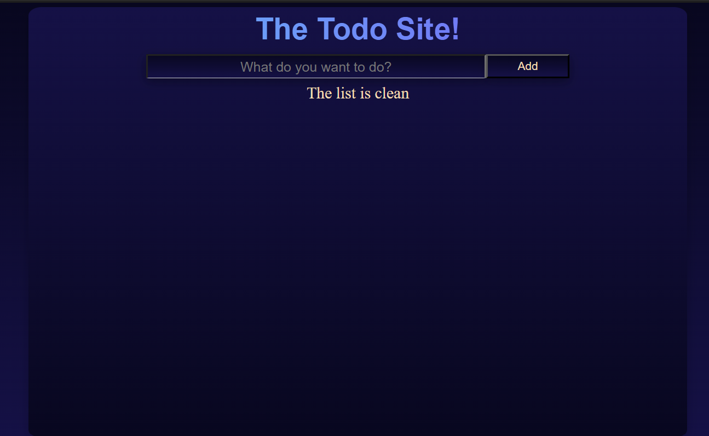

# Elm Todo List App

## What the project does?

This Elm Todo List App is a simple and intuitive application that allows users to manage their tasks efficiently. It provides a user-friendly interface to add, remove, and edit todos, as well as mark them as done and move them to a "Tasks Done" list. The app is designed to enhance productivity by helping users organize their tasks effectively.

## How to startup it?

To get started with the Elm Todo List App, follow these steps:

1. Clone the Repository:

 ```git@gitlab.com:your-username/homework5-edis-sinanovic.git```

1. Go into the directory 

 ```cd homework5-edis-sinanovic```

1. Install Dependencies:

 ```yarn install```

1. Build the project

 ```yarn make```

1. You are now ready to use the site you can use the site be accesing the `index.html` file inside the directory or startup `yarn elm reactor` and acces the site at 
http://localhost:8000/index.html 

For a clear instalation of everything use ```yarn clean``` before ```yarn install```

## Features
- Add Todos:
Users can easily add new todos to the list by entering the task details and clicking the "Add" button.

- Remove Todos:
Deleting unwanted todos is a breeze. Users can simply click the delete icon next to a todo to remove it from the list.

- Edit Todos:
If there are spelling mistakes or other editing needs, users can edit todos by clicking on the task text and making the necessary changes.

- Mark as Done:
Completed tasks can be marked as done with a single click. Once done, they will be moved to the "Tasks Done" list.

- Unmark done task
Users have the flexibility to unmark tasks that were marked as done. This feature allows for adjustments and updates to completed tasks.

- Tasks Done List:
A separate list keeps track of completed tasks, providing a clear overview of accomplishments.

- No Editing for Done Tasks:
Tasks that have been marked as done cannot be edited. This feature encourages users to reflect on completed tasks rather than making changes to them.

This Elm Todo List App is designed to be a straightforward yet powerful tool for managing your daily tasks. It embraces simplicity while providing essential features to make task management a seamless experience.

## ✨ The beauty we talked about ✨

